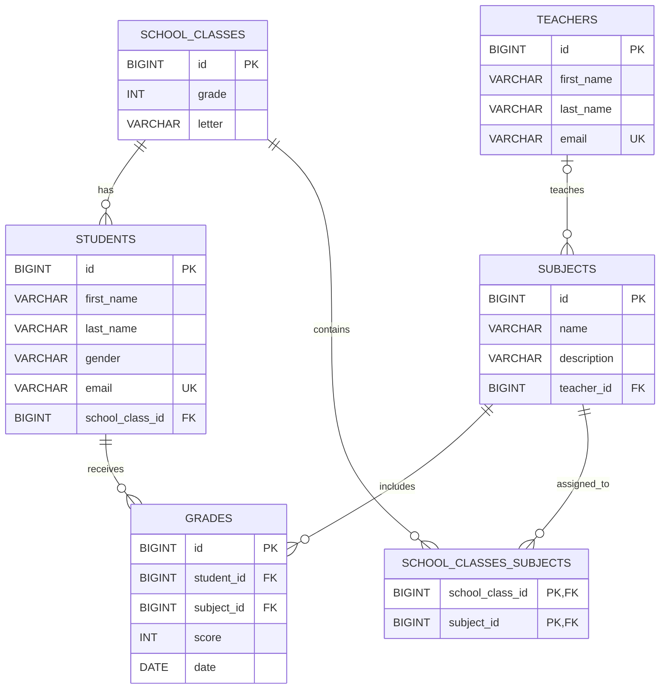

# ШКОЛА 

### REST API проект на Java, фреймворк Spring, Maven. 

1. Реализовать глобальную обработку ошибок через @ControllerAdvice.
2. Добавить валидацию входных данных через @Valid.
3. Реализовать единый формат ошибки для всех endpoint.
4. Настроить логирование через logback:
- уровни логирования
- ротация логов
5. Реализовать аспект (AOP) для логирования времени выполнения сервисных методов.
6. Подключить Swagger/OpenAPI с описанием endpoint и DTO.

1. Реализовать bulk-операцию (POST со списком объектов), имеющую бизнес-смысл в рамках проекта.
2. Использовать Stream API и Optional в сервисном слое.
3. Обеспечить транзакционность bulk-операции. Продемонстрировать работу с/без @Transactional и показать разницу в состоянии БД.
4. Написать:
- unit-тесты для сервисов (Mockito)

[Сонар](https://sonarcloud.io/project/overview?id=tecris-unk_school-project)

