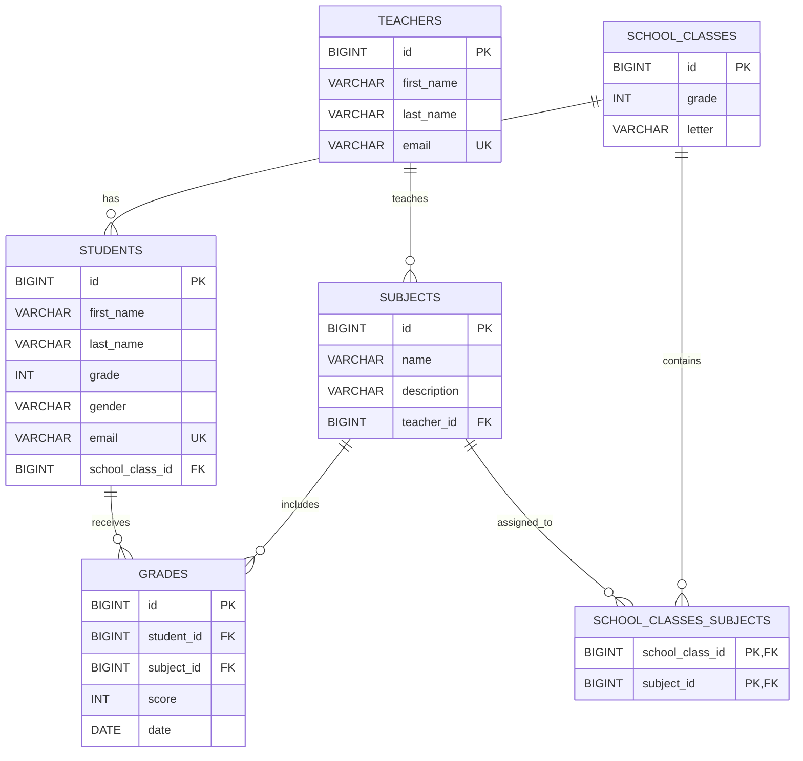

# ШКОЛА 

### REST API проект на Java, фреймворк Spring, Maven. 
 
 	
1. Создать Spring Boot приложение.
2. Реализовать REST API для одной ключевой сущности своей предметной области (domain).
3. Реализовать:
- GET endpoint с @RequestParam
- GET endpoint с @PathVariable
4. Реализовать слои: Controller → Service → Repository.
5. Реализовать DTO и mapper между Entity и API-ответом.
6. Настроить Checkstyle и привести код к стилю.

1. Подключить реляционную БД к проекту.
2. В модели данных реализовать минимум 5 сущностей:
- минимум одну связь OneToMany
- минимум одну связь ManyToMany
3. Реализовать CRUD операции.
4. Настроить и обосновать использование CascadeType и FetchType.
5. Продемонстрировать проблему N+1 и решить её через @EntityGraph или fetch join.
6. Реализовать метод, сохраняющий несколько связанных сущностей. Продемонстрировать частичное сохранение данных без @Transactional и полное откатывание операции с @Transactional при возникновении ошибки.
7. Нарисовать ER-диаграмму с указанием PK/FK и связей.

[Сонар](https://sonarcloud.io/project/overview?id=tecris-unk_school-project)

