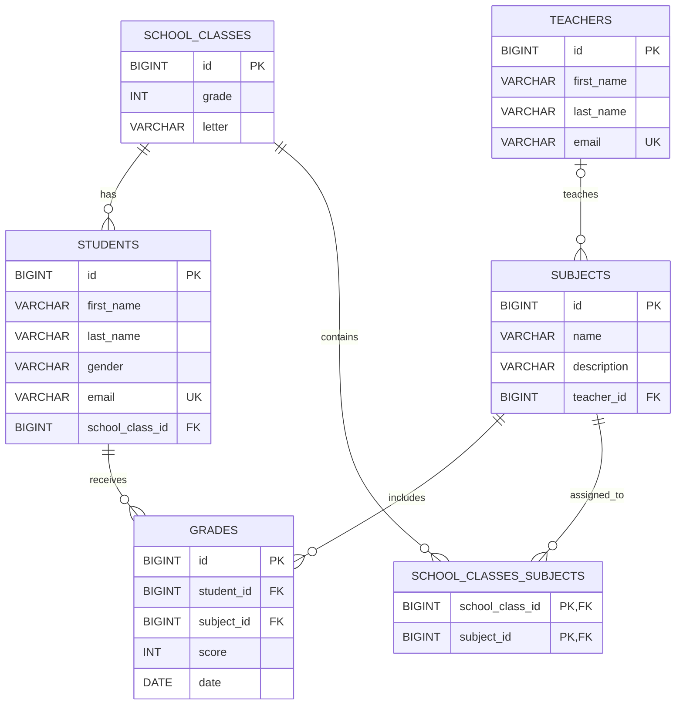

# ШКОЛА 

### REST API проект на Java, фреймворк Spring, Maven. 

1. Подготовить Dockerfile для приложения.
2. Подготовить Docker Compose (приложение + БД).
3. Использовать переменные окружения.
4. Разместить приложение на бесплатном хостинге (PaaS).
5. Настроить CI/CD в GitHub:
- сборка
- тесты
- развертывание
- healthcheck

[Сонар](https://sonarcloud.io/project/overview?id=tecris-unk_school-project)

---

```mermaid
erDiagram
    SCHOOL_CLASSES ||--o{ STUDENTS : has
    TEACHERS o|--o{ SUBJECTS : teaches
    STUDENTS ||--o{ GRADES : receives
    SUBJECTS ||--o{ GRADES : includes
    SCHOOL_CLASSES ||--o{ SCHOOL_CLASSES_SUBJECTS : contains
    SUBJECTS ||--o{ SCHOOL_CLASSES_SUBJECTS : assigned_to

    SCHOOL_CLASSES {
        BIGINT id PK
        INT grade
        VARCHAR letter
    }

    STUDENTS {
        BIGINT id PK
        VARCHAR first_name
        VARCHAR last_name
        VARCHAR gender
        VARCHAR email UK
        BIGINT school_class_id FK
    }

    SCHOOL_CLASSES_SUBJECTS {
        BIGINT school_class_id PK, FK
        BIGINT subject_id PK, FK
    }

    TEACHERS {
        BIGINT id PK
        VARCHAR first_name
        VARCHAR last_name
        VARCHAR email UK
    }

    SUBJECTS {
        BIGINT id PK
        VARCHAR name
        VARCHAR description
        BIGINT teacher_id FK
    }

    GRADES {
        BIGINT id PK
        BIGINT student_id FK
        BIGINT subject_id FK
        INT score
        DATE date
    }

    
```
