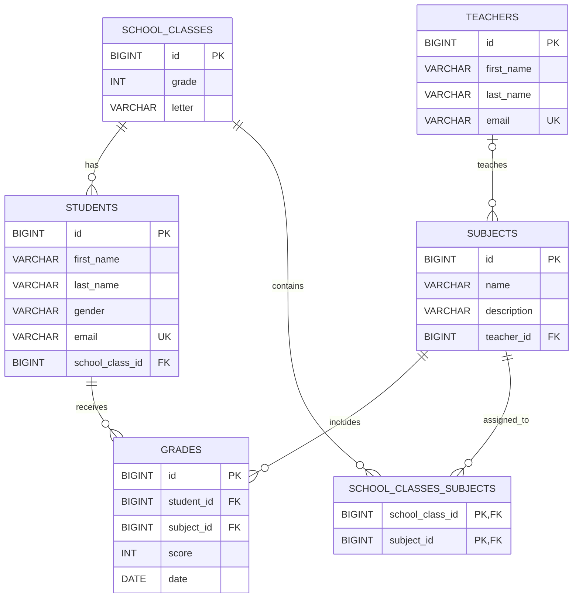

# ШКОЛА 

### REST API проект на Java, фреймворк Spring, Maven. 

1. Реализовать глобальную обработку ошибок через @ControllerAdvice.
2. Добавить валидацию входных данных через @Valid.
3. Реализовать единый формат ошибки для всех endpoint.
4. Настроить логирование через logback:
- уровни логирования
- ротация логов
5. Реализовать аспект (AOP) для логирования времени выполнения сервисных методов.
6. Подключить Swagger/OpenAPI с описанием endpoint и DTO.

1. Реализовать bulk-операцию (POST со списком объектов), имеющую бизнес-смысл в рамках проекта.
2. Использовать Stream API и Optional в сервисном слое.
3. Обеспечить транзакционность bulk-операции. Продемонстрировать работу с/без @Transactional и показать разницу в состоянии БД.
4. Написать:
- unit-тесты для сервисов (Mockito)

[Сонар](https://sonarcloud.io/project/overview?id=tecris-unk_school-project)

Пример запроса:

```http
POST /api/grades/bulk?transactional=true

[
  {"studentId": 1, "subjectId": 1, "score": 9, "date": "2026-01-10"},
  {"studentId": 999999, "subjectId": 1, "score": 7, "date": "2026-01-11"}
]
```

## 1) Глобальная обработка ошибок через `@ControllerAdvice`

### 1.1 Not Found (404)

- **Method:** `GET`
- **URL:** `{{baseUrl}}/api/students/999999`
- **Body:** нет

Ожидается унифицированная ошибка от `GlobalExceptionHandler`.

### 1.2 Conflict (409) — дублирующийся email

Сначала создайте ученика:

- **Method:** `POST`
- **URL:** `{{baseUrl}}/api/students`
- **Headers:** `Content-Type: application/json`
- **Body:**

```json
{
  "firstName": "Ivan",
  "lastName": "Ivanov",
  "gender": "MALE",
  "email": "duplicate.demo@example.com",
  "schoolClassId": null
}
```

Потом отправьте этот же запрос ещё раз с тем же email.
Ожидается `409 Conflict`.

### 1.3 Некорректный тип параметра (400)

- **Method:** `GET`
- **URL:** `{{baseUrl}}/api/students/not-a-number`

Ожидается `400` с сообщением о неверном типе параметра.

### 1.4 Некорректный JSON (400)

- **Method:** `POST`
- **URL:** `{{baseUrl}}/api/students`
- **Headers:** `Content-Type: application/json`
- **Body:**

```json
{
  "firstName": "Ivan",
  "lastName": "Ivanov",
  "gender": "MALE",
  "email": "broken-json@example.com",
```

(специально незакрытый JSON)

---

## 2) Валидация входных данных через `@Valid`

### 2.1 Валидация тела запроса (`@Valid @RequestBody`) (400)

- **Method:** `POST`
- **URL:** `{{baseUrl}}/api/students`
- **Headers:** `Content-Type: application/json`
- **Body:**

```json
{
  "firstName": "",
  "lastName": "",
  "gender": "",
  "email": "invalid-email",
  "schoolClassId": null
}
```

Ожидается `400` и `details` с ошибками по полям.

### 2.2 Валидация query/path параметров (400)

- **Method:** `GET`
- **URL:** `{{baseUrl}}/api/students?teacherEmail=wrongEmail&minScore=-1`
- **Body:** нет

Ожидается `400` из-за `@Email` и `@Min(0)`.

---

## 3) Логирование через logback (уровни + ротация)

Это проверяется запросами + просмотром логов.

### 3.1 Сгенерировать INFO/WARN логи

1. Успешный запрос (INFO):
   - `GET {{baseUrl}}/api/students/1`
2. Ошибочный запрос (WARN):
   - `GET {{baseUrl}}/api/students/-1`

### 3.2 Проверить файл логов и ротацию

- основной файл: `logs/school-app.log`
- архивы: `logs/archive/school-app.YYYY-MM-DD.N.log.gz`

---

## 4) AOP-аспект на время выполнения сервисных методов

В логах должно быть время работы каждого метода в сервисе

---

## 5) Swagger/OpenAPI с описанием endpoint и DTO

### 5.1 Swagger UI

- **Method:** `GET`
- **URL:** `{{baseUrl}}/swagger-ui/index.html`

### 6.2 OpenAPI JSON

- **Method:** `GET`
- **URL:** `{{baseUrl}}/v3/api-docs`
- 
---



```mermaid
erDiagram
    SCHOOL_CLASSES ||--o{ STUDENTS : has
    TEACHERS o|--o{ SUBJECTS : teaches
    STUDENTS ||--o{ GRADES : receives
    SUBJECTS ||--o{ GRADES : includes
    SCHOOL_CLASSES ||--o{ SCHOOL_CLASSES_SUBJECTS : contains
    SUBJECTS ||--o{ SCHOOL_CLASSES_SUBJECTS : assigned_to

    SCHOOL_CLASSES {
        BIGINT id PK
        INT grade
        VARCHAR letter
    }

    STUDENTS {
        BIGINT id PK
        VARCHAR first_name
        VARCHAR last_name
        VARCHAR gender
        VARCHAR email UK
        BIGINT school_class_id FK
    }

    SCHOOL_CLASSES_SUBJECTS {
        BIGINT school_class_id PK, FK
        BIGINT subject_id PK, FK
    }

    TEACHERS {
        BIGINT id PK
        VARCHAR first_name
        VARCHAR last_name
        VARCHAR email UK
    }

    SUBJECTS {
        BIGINT id PK
        VARCHAR name
        VARCHAR description
        BIGINT teacher_id FK
    }

    GRADES {
        BIGINT id PK
        BIGINT student_id FK
        BIGINT subject_id FK
        INT score
        DATE date
    }

    
```
