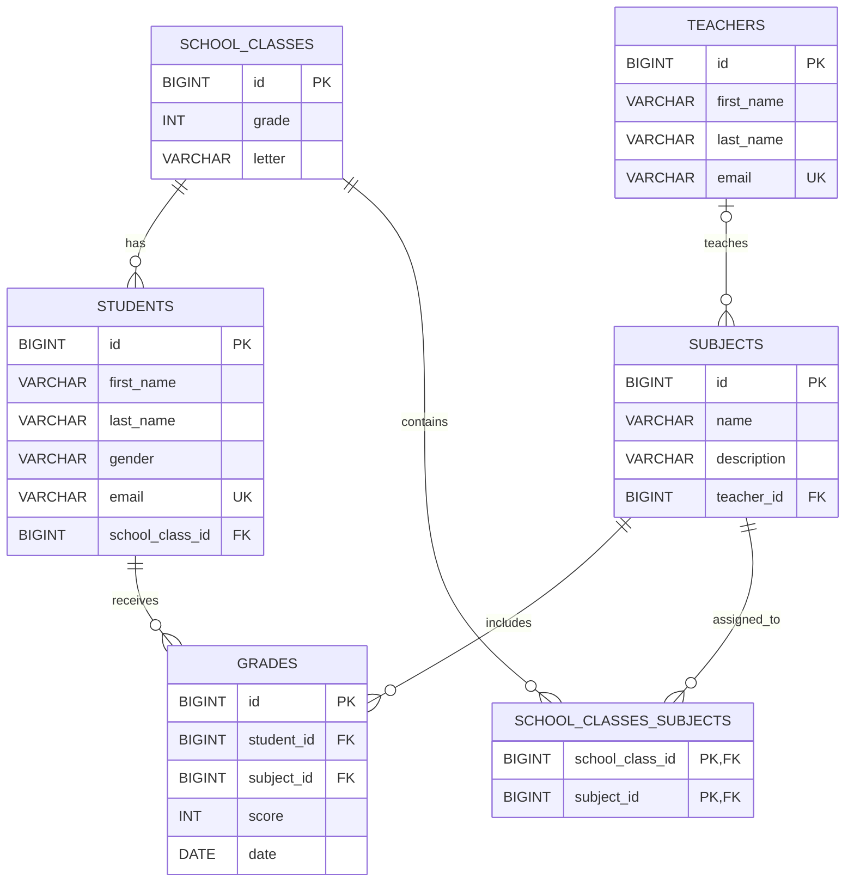

# ШКОЛА 

### REST API проект на Java, фреймворк Spring, Maven. 

1. Подготовить Dockerfile для приложения.
2. Подготовить Docker Compose (приложение + БД).
3. Использовать переменные окружения.
4. Разместить приложение на бесплатном хостинге (PaaS).
5. Настроить CI/CD в GitHub:
- сборка
- тесты
- развертывание
- healthcheck

## Технологический стек

- **Java 21**
- **Spring Boot 3.3.8**
- **Spring Web / Validation / Data JPA / AOP / Actuator**
- **PostgreSQL 16**
- **Maven**
- **Lombok**
- **springdoc-openapi (Swagger UI)**
- **Docker + Docker Compose**
- **JaCoCo + Checkstyle + SonarCloud**

# Быстрый старт

### Вариант 1: запуск через Docker Compose (рекомендуется)

    
```bash
docker compose up --build
```

После запуска доступны:
- API: `http://localhost:8080`
- Swagger UI: `http://localhost:8080/swagger-ui.html`
- Health check: `http://localhost:8080/actuator/health`

---

### Вариант 2: локальный запуск (без Docker)

1) Поднять PostgreSQL и создать БД `school`.

2) Указать переменные окружения (или оставить дефолты).

3) Запустить приложение:

```bash
mvn spring-boot:run
```

---

##  Переменные окружения

| Переменная | По умолчанию | Назначение |
|---|---:|---|
| `APP_PORT` | `8080` | Порт приложения |
| `SPRING_APPLICATION_NAME` | `school-project` | Имя сервиса |
| `SPRING_DATASOURCE_URL` | `jdbc:postgresql://db:5432/school` | URL БД |
| `SPRING_DATASOURCE_USERNAME` | `postgres` | Пользователь БД |
| `SPRING_DATASOURCE_PASSWORD` | `your_password` | Пароль БД |
| `SPRING_JPA_HIBERNATE_DDL_AUTO` | `update` | Стратегия схемы |
| `SPRING_JPA_SHOW_SQL` | `true` | Логирование SQL |
| `SPRING_JPA_FORMAT_SQL` | `false` | Форматирование SQL |

---

## API overview

Базовые группы endpoint’ов:

- `GET/POST/PUT/DELETE /api/students`
- `POST /api/students/with_grades`
- `GET/POST/PUT/DELETE /api/teachers`
- `GET/POST/PUT/DELETE /api/subjects`
- `GET/POST/PUT/DELETE /api/classes`
- `PUT /api/classes/{classId}/subjects/{subjectId}`
- `GET/POST/PUT/DELETE /api/grades`
- `POST /api/grades/bulk`
- `POST /api/tasks`, `GET /api/tasks/{taskId}`
- `GET /api/concurrency/race-demo`

Полная спецификация: Swagger UI (`/swagger-ui.html`) и OpenAPI JSON (`/v3/api-docs`).

---

## Качество и эксплуатация

- Unit + integration тесты на сервисный и API уровни.
- Actuator health probes для readiness/liveness.
- JaCoCo отчёты покрытия.
- Checkstyle для единообразного кода.
- SonarCloud для статического анализа.

Sonar: https://sonarcloud.io/project/overview?id=tecris-unk_school-project

---

## Контейнеризация

Проект поставляется с готовыми:
- `Dockerfile` (multi-stage build: Maven build → JRE runtime)
- `docker-compose.yml` (приложение + PostgreSQL + healthchecks)

Это даёт быстрый onboarding и предсказуемое окружение в любой среде.

---

## Roadmap

- JWT/OAuth2 авторизация и ролевая модель (Admin/Teacher/Student).
- Миграции Flyway/Liquibase вместо `ddl-auto`.
- API versioning и backward compatibility policy.
- Redis-кеш + rate limiting.
- Нотификации (email/telegram) по событиям успеваемости.

---

## Для разработчиков

Полезные команды:

```bash
# Сборка
mvn clean package

# Тесты
mvn test

# Запуск приложения
mvn spring-boot:run
```

---

[Сонар](https://sonarcloud.io/project/overview?id=tecris-unk_school-project)

---


```mermaid
erDiagram
    SCHOOL_CLASSES ||--o{ STUDENTS : has
    TEACHERS o|--o{ SUBJECTS : teaches
    STUDENTS ||--o{ GRADES : receives
    SUBJECTS ||--o{ GRADES : includes
    SCHOOL_CLASSES ||--o{ SCHOOL_CLASSES_SUBJECTS : contains
    SUBJECTS ||--o{ SCHOOL_CLASSES_SUBJECTS : assigned_to

    SCHOOL_CLASSES {
        BIGINT id PK
        INT grade
        VARCHAR letter
    }

    STUDENTS {
        BIGINT id PK
        VARCHAR first_name
        VARCHAR last_name
        VARCHAR gender
        VARCHAR email UK
        BIGINT school_class_id FK
    }

    SCHOOL_CLASSES_SUBJECTS {
        BIGINT school_class_id PK, FK
        BIGINT subject_id PK, FK
    }

    TEACHERS {
        BIGINT id PK
        VARCHAR first_name
        VARCHAR last_name
        VARCHAR email UK
    }

    SUBJECTS {
        BIGINT id PK
        VARCHAR name
        VARCHAR description
        BIGINT teacher_id FK
    }

    GRADES {
        BIGINT id PK
        BIGINT student_id FK
        BIGINT subject_id FK
        INT score
        DATE date
    }

    
```
